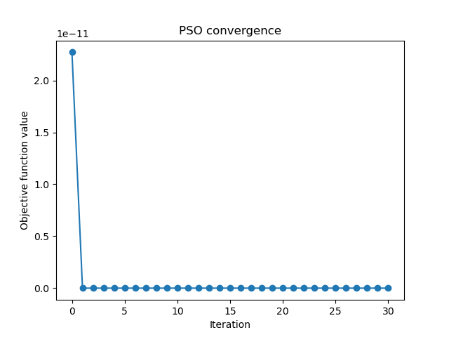
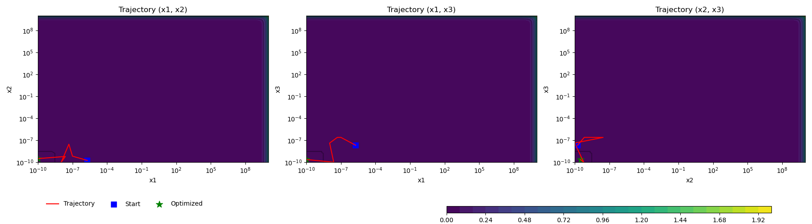

# Particle Swarm Optimization (PSO) in Python

[](https://www.python.org/)
[](LICENSE)

Python implementation of Particle Swarm Optimization (PSO) supporting any number of dimensions, logarithmic scaling for parameters with different magnitudes, early stopping based on convergence, and visualization of particle trajectories and contour plots for multi dimensions optimization problems.

---

## Features

- Any number of dimensions supported (2D, 3D, and higher).
- Logarithmic scaling for parameters with vastly different orders of magnitude.
- Early stopping if the best value does not improve over several iterations.
- Visualization of particle trajectories and contour plots.
- Configurable PSO parameters: number of particles, maximum iterations, inertia weight, cognitive and social coefficients.
- Legends and colorbars organized for clear visualization.

---

## Installation

Clone the repository and install dependencies:

```bash
git clone https://github.com/yourusername/pso-project.git
cd pso-project
pip install -r requirements.txt\
```

---

## Usage 

Edit main.py to define your own objective function and parameter bounds.

---

## Example Plots

Convergence plot: shows how the best objective value evolves over iterations.
Trajectory plots: for all pairs of dimensions in 2D/3D problems, including contour plots.

(Include screenshots in plots/ folder and reference them here)




---

## Adding New Problems

1 - Create a new function in main.py or add a separate file in the examples/ folder.

2 - Update the parameter bounds accordingly.

3 - Create a new PSO instance and call optimize() and plot_metrics().

---

## License

This project is licensed under the MIT License - see the LICENSE

---

## Dependencies

Python >= 3.8

numpy

matplotlib

You can install all dependencies via:
```bash
pip install -r requirements.txt
```

